# 1.概要
データサイエンティストが普段使いしやすい環境を目指しました。



# 2. 環境の使用方針

dockerを使っているので、virtual environmentは使わない方針です。
複数の環境をを使い分けたくなったら別のdocker imageを作る方針がおすすめです。

# 3. 想定している使い方

## 3.1. 起動と終了
下記のコマンドで起動します。
```bash
docker-compose up -d
```

Dockerを落とす場合は、下記のコマンドを実行して下さい。
```bash
docker-compose up -d
```

## 3.2. JupyterLabへのアクセス
Dockerを起動させた後に、
https://:localhost:8888/lab でjupyter labにアクセスできます。

## 3.3. ファイル
<project_root>/workspace 配下のファイルが
Dockerコンテナ上の /code配下のファイルと同期しています。

なので、ソースコードの管理をする場合は、ホスト側(≠コンテナ側)の
workspace配下にソースコードを追加してください。
ソースコードの追加は、ホスト側だけでなくコンテナ側、つまり、JupyterLabからも行えます。

## 3.4. Pythonパッケージのインストール(一時的)
Pythonのパッケージを入れたくなったらJupyerLab上で下記のコマンドを実行してください。
``` bash
pip install <package_name>
```
ただし、Dockerを終了すると消えます。
試しに使ってみるパッケージは、この方式でインストールしてください。
ずっと使うパッケージは、次節の手順で永続化してください。

## 3.5. Pythonパッケージのインストール(永続化)

この操作は、Docker コンテナを停止させるとき:お仕事が一段落したとき、
お昼ごはんを食べに行くとき、終業のとき・・・にやるといいです。

### 3.5.1 requirements.txtにパッケージ名を追記
コンテナを起動するたびに必ずインストールされている状態にしたいパッケージは、
<project_root>/workspace/requirements.txt に記載してください。

起動しているDokcerコンテナ上にインストールされているパッケージの一覧を
取得するには、任意の .ipnbファイルを開いて、下記のコマンドを実行して下さい。
```bash
pip list
```
出力例
```
Package           Version
----------------- ---------
numpy             1.19.1
packaging         20.4
pandas            1.1.1
```
Package列に書かれているパッケージ名(numpy, pandas等)を
<project_root>/workspace/requirements.txtに記載してください。


### 3.5.2 Dockerコンテナの再ビルド
requirements.txtにパッケージを追加した後は、下記のコマンドを忘れず実行してください。
```bash
docker-compose build
```
Dockerのキャッシュの関係で、
```docker-compose up -d ```だけでは、
Dockerfileの
```RUN pip install -r /pip_packages/requirements.txt```
で実行するパッケージのインストールの更新が行われないためです。

## 3.6. pip以外でインストールするパッケージ(一時的)
pip で入らないパッケージ、例)nkf mecab 等、があれば、基本的には
jupyter labのコンソール上で
```
apt-get install <package_name>
```
してください。

curlやwget経由でインストールする場合は、基本的にコンソール上で作業して下さい


## 3.7. pip以外でインストールするパッケージ(永続化)

apt-get でインストールしたパッケージは、Dockerfileの下記の箇所に追記してください。

```Dockerfile
RUN apt-get update \
    && apt-get -y install --no-install-recommends nodejs \
    npm \
    <追加したいパッケージ1>\
    <追加したいパッケージ2>\
    ・・・
    <追加したいパッケージn>\
    && apt-get clean \
    && rm -rf /var/lib/apt/lists/*
```
apt-getでインストールパッケージは
```apt list```で閲覧できます。
ただし、インストール日時は保存していないです。

下記のファイルの一番最後から順に追っていくと、最近インストールしたパッケージがそれなりに見つけやすいです。
```bash
/var/log/apt/term.log
/var/log/apt/history.log
```
ただし、dockerのvolumeに永続化しているわけではないので、一度Dockerを停止させると消えると思います。


curlやwget経由で永続的にインストールする場合も、Dockerfile側にインストールの処理を書いてください。
[この辺](https://github.com/arrowkato/nlp_docker/blob/master/Dockerfile)が参考になるかもしれないです。

# 4. カスタマイズしたくなったとき

## 4.1. Pythonのバージョンを変えたくなったとき
Pythonのバージョンを変えたくなったら、Dockerfileの下記のところのバージョンを書き換えてください。
```dockerfile
FROM python:3.8.5-slim-buster
```

e.g. Python 3.9のDocker Imageを使う場合
```dockerfile
FROM python:3.9.0rc1-slim-buster
```

[Dockerで使用できるPythonのバージョン](https://hub.docker.com/_/python?tab=description)


## 4.2 Pythonのパッケージ
Pythonのパッケージはpipで管理しています。
インストールしたいパッケージは ./workspace/requirements.txt に記載してください。

poetry, pyenvを使いたい場合はお好みで追加してください。
ただし、Dockerfileを含めて環境を作り直す必要があるので、結構手間がかかると思います。


